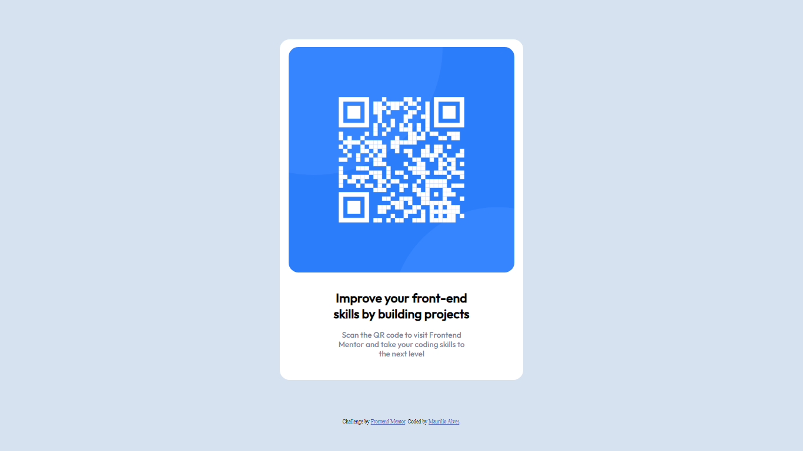

# Frontend Mentor - Solução de componente de QR Code

Esta é uma solução do [desafio do componente de QR Code do Frontend Mentor](https://www.frontendmentor.io/challenges/qr-code-component-iux_sIO_H). Os desafios do Frontend Mentor ajudam você a melhorar suas habilidades de codificação através da construção de projetos reais. 

## Índice

- [Visão Geral](#Visão-Geral)
  - [Captura de Tela](#Captura-de-Tela)
  - [Links](#links)
- [Meu Processo](#Meu-Processo)
  - [Construído com](#Construído-com)
  - [O que eu aprendi](#O-que-eu-aprendi)
  - [Desenvolvimento Contínuo](#Desenvolvimento-Contínuo)
  - [Autor](#autor)

## Visão Geral

### Captura de Tela


Esta é uma captura de tela do meu projeto que tentei criar o mais próximo possível do design original.

### Links

- [Solução]([https://your-solution-url.com](https://www.frontendmentor.io/solutions/componente-qr-code-soluo-7eHz_-wWw8))
- [Site]([https://your-live-site-url.com](https://maurilioalves462.github.io/Componente-QR-Code/))

## Meu Processo

### Construído com

- HTML5 markup
- CSS3

### O que eu aprendi

Em modo geral, aprendi mais sobre como estar utilizando os recursos de personalização do CSS. Pois sabendo onde irão estar sendo utilizados é que faz toda a diferença. 

```css
.homepage {
    background-color: white;
    width: 620px;
    margin: 100px auto;
    border-radius: 25px;
    padding:auto;
    padding-bottom: 5px;
    text-align:center;
 }
 
 img {
    margin: 20px 10px;
    border-radius: 25px;
 }
```


### Desenvolvimento Contínuo

Gostaria mais de estar aperfeiçoando os meu conhecimentos sobre o CSS, não diria que foi desafiador, porém sei que preciso praticar mais. E o Frontend Mentor nos ajuda bastante nesse requisito. 

## Autor

- Instagram - [@xmauro.alvesx](https://www.instagram.com/xmauro.alvesx/)
- Frontend Mentor - [Maurílio Alves](https://www.frontendmentor.io/profile/Maurilioalves462)
- Linkedlin - [Maurílio Alves](www.linkedin.com/in/maurílio-alves-889b641a1)
